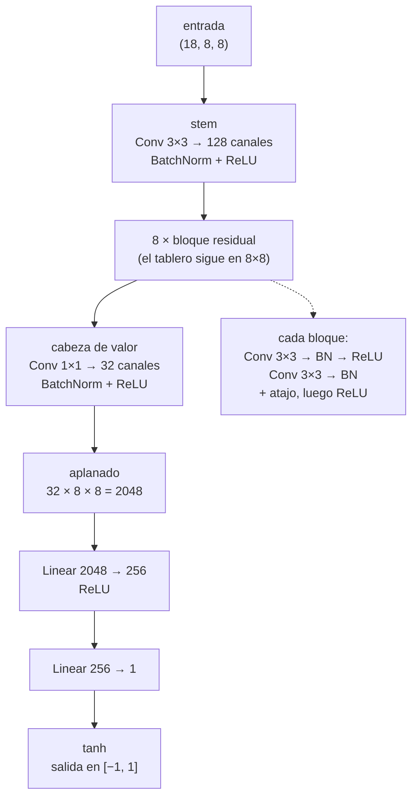
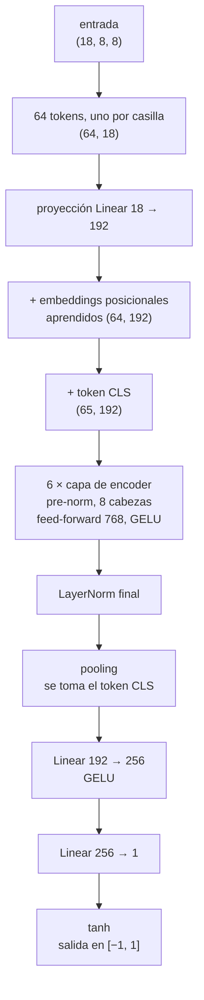

# Alcance del bloque 4 — Red neuronal

Documento de alcance de la tarea 4 del WBS (*Desarrollo de la red neuronal*,
144 h). Fija qué se construye, qué decisiones ya están tomadas y por qué, y qué
queda explícitamente afuera. Se escribe **antes** de codificar para que la
comparación entre arquitecturas sea una comparación y no una acumulación de
diferencias.

## Qué se entrega

| Entregable del plan | Cómo se cumple |
|---|---|
| Pesos de la red en formato estándar (`.pt`) | Repositorio de modelos en Hugging Face |
| Registro del experimento (hiperparámetros, curvas, métricas) | Mismo repositorio, junto a cada checkpoint |
| Diagrama de la arquitectura de la red | [Más abajo en este documento](#diagramas-de-las-arquitecturas), una por arquitectura |
| Métricas sobre validación y test | Tabla de resultados de este documento; **falta el desglose de 4.7** |

## Las dos arquitecturas

El plan pone la ResNet como **línea base obligatoria** (tarea 4.2) y el
transformer como **exploración opcional** (tarea 4.8, requerimiento 6.1,
historia 3). Por decisión del autor, en este proyecto el transformer se trata
como obligatorio: la comparación entre ambas es el aporte central del trabajo.

Eso no cambia el orden. La ResNet se entrena, se ajusta y se evalúa completa
(4.2 → 4.7) antes de empezar el transformer. Si el tiempo se corta, lo que queda
entregado es una línea base sólida y no dos modelos a medio hacer.

### Por qué se implementan desde cero

**No se usan arquitecturas pre-entrenadas ni de librería.** No es purismo
académico, es que no aplican:

- La entrada es un tensor de **(18, 8, 8)**. Una ResNet de `torchvision` empieza
  con una convolución 7×7 de stride 2 seguida de max-pooling: en dos pasos deja
  el tablero en 2×2. Está diseñada para imágenes de 224×224, no para un tablero.
- Los pesos pre-entrenados de ImageNet o de un ViT no transfieren nada a una
  representación de ajedrez: no hay texturas ni bordes que reutilizar.
- La ResNet de ajedrez es corta —convolución 3×3 con padding 1, que mantiene el
  tablero en 8×8 en toda la red, más bloques residuales y una cabeza de valor—.
  Implementarla es más simple que doblegar una librería, y la tarea 4.2 pide
  exactamente eso.
- Para el transformer sí se usan los bloques de `torch.nn`
  (`MultiheadAttention`, `TransformerEncoderLayer`): reimplementar la atención a
  mano no aporta nada y agrega superficie de error. Lo que se escribe es la
  arquitectura —tokenización, embeddings posicionales, cabeza—, que es la parte
  que hay que justificar y diagramar.

### Tokenización del transformer

**Una casilla = un token**, 64 tokens de longitud fija. Los embeddings
posicionales son **aprendidos** (una tabla de 64 × `d_model`): el tablero tiene
geometría fija y conocida, no hace falta nada sinusoidal.

Hay un detalle de la codificación que conviene tener presente: de los 18 planos,
**12 son espaciales** (las piezas) y **6 son constantes sobre todo el tablero**
(los cuatro de enroque, el reloj de 50 jugadas; el de captura al paso es
espacial). Para una CNN, difundir un escalar sobre los 64 casilleros es lo
normal. Para un transformer es redundante: repite el mismo valor en los 64
tokens.

Se arranca igual con los 18 planos en ambas arquitecturas, **para que la entrada
sea idéntica y la diferencia observada sea atribuible a la arquitectura**. La
variante de "64 tokens de pieza + 1 token de estado" queda como experimento de
la tarea 4.5, no como punto de partida.

### Presupuesto de parámetros

Comparar arquitecturas con tamaños distintos no responde la pregunta: si el
transformer gana con el triple de parámetros, no se sabe si ganó la atención o
el tamaño. Se arranca con presupuestos equiparados:

| Arquitectura | Configuración inicial | Parámetros |
|---|---|---|
| ResNet | 128 canales × 8 bloques residuales | ~2,9 M |
| Transformer | `d_model` 192, 6 capas, 8 cabezas | ~2,7 M |

Ambas se entrenan además con el mismo presupuesto de épocas y el mismo
optimizador antes de cualquier ajuste específico.

## Diagramas de las arquitecturas

Entregable del plan. Los dos diagramas describen las redes tal como quedaron
implementadas en `src/chessdl/models/`, con las configuraciones que produjeron
los resultados publicados.

### ResNet — 2.913.345 parámetros



Las convoluciones son de 3×3 con relleno 1, así que el tablero **nunca se
reduce**: entra en 8×8 y llega en 8×8 a la cabeza. Es la diferencia central con
una ResNet de visión, cuyo stem de 7×7 con stride 2 más max-pooling dejaría el
tablero en 2×2 en dos pasos.

La convolución 1×1 de la cabeza existe para recortar el ancho antes del
aplanado: sin ella, aplanar 128 canales daría 8192 entradas y la capa densa
sola se llevaría dos millones de parámetros.

### Transformer — 2.735.361 parámetros



Los embeddings posicionales son **aprendidos, no sinusoidales**: un tablero no
es una secuencia, y la distancia entre a1 y a2 no es comparable con la que hay
entre a1 y b1 de ninguna forma que capture una sinusoide. Son 64 posiciones
fijas y cada una recibe su propio vector.

El pre-norm (`norm_first`) no es cosmético: los transformers post-norm son
difíciles de arrancar desde cero sin un calentamiento largo, y el presupuesto
acá es una sesión de Colab.

Las dos redes terminan en `tanh`, así que el rango que pide el requerimiento 1.4
está **garantizado por construcción** y no aprendido — vale desde la primera
inicialización al azar y no puede derivar. Es además la misma operación que
generó las etiquetas (`value = tanh(cp / 400)`).

## Decisiones ya tomadas

### Target y escala

Se entrena contra **`value_stm`**, la etiqueta en perspectiva del jugador al
turno, que es la que corresponde a la entrada espejada. `value_white` se obtiene
con el cambio de signo y es lo que reportan el motor y la CLI (requerimientos 1.4
y 4.2).

### Partición: por partida, no por posición

**Es la decisión metodológica más importante del bloque.** El dataset tiene 4
posiciones por partida sobre 772.797 partidas. Una partición aleatoria *por
posición* deja posiciones de la misma partida en entrenamiento y en test: comparten
apertura, jugadores y estructura, y la métrica de validación queda inflada.

La deduplicación global por `pos_key` elimina los duplicados exactos, pero no
esta correlación. La partición se hace **por `game_id`**, con semilla fija:

```
entrenamiento 90 %   ·   validación 5 %   ·   test 5 %
```

La columna ya está en el dataset, así que hacerlo bien no cuesta nada. Hacerlo
mal no se detecta hasta que el motor juega contra Stockfish y rinde peor de lo
que decían las métricas.

### Función de pérdida (tarea 4.3)

Punto de partida **MSE** sobre `value_stm`. La alternativa a evaluar en 4.5 es
**Huber / smooth L1**, y hay un motivo concreto para probarla: el 1,43 % de las
posiciones son mates que saturan en ±0,9999, y el recorte a ±2000 centipeones
apila masa en los extremos. MSE pondera esos casos por el cuadrado del error.

### Piso de referencia

Antes de cualquier red se miden dos baselines no neuronales, que cuestan una hora
y hacen interpretable el RMSE:

1. **Predecir la media constante.** El piso ya se conoce del análisis
   exploratorio: RMSE = **0,488** (el desvío de `value_white`). Cualquier modelo
   tiene que ganarle; si no le gana, hay un error de implementación, no un
   problema de arquitectura.
2. **Conteo de material** (regresión lineal sobre los planos de pieza). Es el
   piso "sabe algo de ajedrez" contra el que se mide cuánto aporta la red.

## Persistencia y reanudación en Hugging Face

Mismo criterio que el pipeline de datos: **nada durable en disco local**. Se suma
un tercer repositorio, esta vez de tipo *Model*:

| Repositorio | Contenido |
|---|---|
| `zFonta/ceia-chess-eval` | Dataset (ya publicado) |
| `zFonta/ceia-chess-work` | Extracto PGN y estado del pipeline de datos |
| `zFonta/ceia-chess-models` | **Nuevo:** checkpoints, configuración y métricas |

Cada checkpoint guarda pesos, estado del optimizador y del scheduler, época,
estado de los generadores aleatorios y el historial de métricas. Con eso una
desconexión de Colab cuesta como mucho una época, igual que en el pipeline de
datos una desconexión costaba como mucho un shard.

Se conservan el **último** checkpoint y el **mejor por métrica de validación**;
los intermedios se van pisando para no llenar el repositorio. El historial de
métricas se sube como archivo aparte en cada época, así las curvas de pérdida
—que son un entregable del plan— sobreviven aunque se pierda el runtime.

## Métricas (tarea 4.7)

| Métrica | Para qué |
|---|---|
| RMSE sobre `value` | Métrica primaria de entrenamiento y comparación |
| MAE en centipeones | Escala interpretable, vía transformación inversa |
| Acuerdo de signo | ¿Acierta quién está mejor? Es lo que usa la búsqueda |
| Correlación de Spearman | Ordenamiento, que es lo que importa para elegir jugada |

Una advertencia sobre el RMSE en centipeones: la transformación inversa es **no
lineal** y diverge cerca de ±1, así que un RMSE calculado en centipeones queda
dominado por las posiciones saturadas y dice más sobre los mates que sobre el
juego normal. Por eso la métrica primaria se reporta en escala de `value`, y en
centipeones se reporta MAE, que es menos sensible a esa cola.

## Consideraciones y riesgos

### Sobre el tiempo de respuesta

El requerimiento 1.7 (5 segundos por jugada, búsqueda incluida) **no se verifica
en este bloque**. Depende de dónde corra el motor, y el motor todavía no existe:
su verificación es del bloque 5.

Lo único que se hace acá es **registrar el tiempo de inferencia por lote** en el
entorno donde se entrena, como dato de referencia. Es gratis de medir y le ahorra
trabajo al bloque 5, pero no condiciona la arquitectura.

### Entorno de entrenamiento: GPU T4, runtime estándar

El entrenamiento corre en **Colab Pro** (plan de USD 10, ~100 unidades de cómputo
mensuales). La recomendación es el **runtime de GPU estándar (T4), sin high-RAM**,
y conviene justificarla porque el reflejo natural es pedir la GPU más grande
disponible.

El modelo es chico y el tablero es de 8×8. Estimando el costo por época sobre el
90 % de entrenamiento:

| Arquitectura | FLOPs/muestra | Por época | T4 | L4 | A100 |
|---|---|---|---|---|---|
| ResNet 128×8 | 306 M | 2,1 PFLOPs | ~2,3 min | ~0,9 min | ~0,4 min |
| Transformer d=192 ×6 | 359 M | 2,5 PFLOPs | ~2,7 min | ~1,0 min | ~0,4 min |

Una campaña de 50 épocas en T4 son unas **2 horas**. Pasar a A100 la bajaría a
~20 minutos, pero **quema unidades del orden de seis veces más rápido**: con 100
unidades mensuales, la T4 rinde decenas de horas y la A100 se agota en una tarde.
Para un modelo de 3 M de parámetros sobre entradas de 8×8 ese gasto no compra
nada, porque la GPU grande queda desaprovechada: con dimensiones espaciales tan
chicas, la utilización es baja sin importar el hardware.

Las estimaciones de la tabla tienen margen de error amplio —la utilización real
sobre tensores de 8×8 es difícil de predecir— y se reemplazan por la medición
efectiva en la tarea 4.1. El orden de magnitud sí es confiable, y es el que
sustenta la decisión.

Tres detalles del runtime que importan más que el modelo de GPU:

- **Lotes grandes** (1.024 a 4.096). Con 8×8 de resolución, un lote chico deja la
  GPU haciendo nada entre kernels. Es la palanca más efectiva de las tres.
  **Corregido por la evidencia, ver abajo.**
- **Precisión mixta (AMP)**. La T4 tiene tensor cores; usar `float16` en el
  forward es prácticamente gratis en código y cambia bastante el tiempo.
- **RAM estándar alcanza.** El caché de tensores son 2,9 GB en `uint8` contra los
  12,7 GB del runtime estándar. High-RAM gastaría más unidades sin necesidad.

No se usa **TPU**: PyTorch sobre XLA agrega complejidad de compilación y de
depuración que no se justifica para un modelo de este tamaño.

> **Corrección sobre el tamaño de lote.** Lo anterior se escribió antes de
> entrenar, y el barrido del transformer lo contradice por partida doble.
>
> En **calidad**, el lote de 512 le ganó al de 1.024 (validación 0,2635 contra
> 0,2725): con un modelo que subajusta, lo que importa no es el tiempo por época
> sino cuántas actualizaciones entran en ella, y partir el lote las duplica.
>
> En **velocidad**, que era el argumento original, tampoco se cumplió: las épocas
> con lote 512 tardaron **658 s contra 736 s** del lote 1.024, un 11 % *menos*.
> La atención sobre 65 tokens con lotes grandes genera matrices que presionan el
> ancho de banda de memoria, así que agrandar el lote dejó de pagar antes de lo
> previsto. Con la salvedad de que Colab pudo haber asignado GPUs distintas entre
> una campaña y otra, no es una medición controlada.
>
> La conclusión que sí se sostiene es la de la ResNet, que es donde se estimó: el
> argumento de la utilización vale para convoluciones sobre 8×8, no se traslada
> automáticamente a la atención.

Si durante el ajuste de hiperparámetros (4.5) hiciera falta iterar más rápido, el
escalón sensato es **L4**, no A100.

### El runtime de Colab cambia de signo

Toda la fase de datos pedía **CPU** y `colab.py` avisa si detecta una GPU. Para
entrenar eso se invierte. La función `describe_runtime()` necesita saber en qué
fase está, o va a dar un consejo equivocado con mucha seguridad.

### Composición del dataset

El dataset es **91,4 % Blitz** (ver `dataset_card.md`). No invalida nada, pero al
reportar resultados conviene desglosar por `time_control`: es una línea de código
y responde de antemano una pregunta previsible del director.

### El cuello de botella esperado es el dataloader, no la GPU

Codificar una posición por el camino directo (FEN → `Board` → tensor) cuesta
**79 µs**, de los cuales 44 µs son parsear el FEN. Son ~12.600 posiciones por
segundo y por núcleo; con las 2 vCPU que Colab viene asignando, unos 100 segundos
por época solo en codificar, con la GPU esperando.

Puesto al lado del costo de GPU de la sección anterior, el problema se ve claro:
la T4 necesita ~140 segundos por época y codificar sobre la marcha cuesta ~100.
Son del mismo orden, así que sin caché el tiempo por época casi se duplica y la
mitad del gasto de unidades se va en esperar a la CPU.

La salida es precomputar los tensores una sola vez: **2,9 GB en `uint8`** (los
planos son binarios salvo el reloj de 50 jugadas), que entra en memoria o se mapea
de disco, y se castea a `float32` en GPU. El costo es de unos dos minutos de CPU
una única vez, y a partir de ahí el dataloader es rebanar un array.

Esto **no modifica el dataset**: el Parquet sigue guardando FENs, que fue la
decisión de diseño para poder cambiar la representación sin re-etiquetar. Es un
caché de entrenamiento, descartable.

## Fuera de alcance

- **Todo lo que no sea predecir la evaluación.** La red tiene una única tarea:
  dado un FEN, replicar el puntaje que le asigna Stockfish. No hay cabeza de
  política ni predicción de jugadas. La historia 2 menciona "predice
  movimientos", pero el requerimiento 1.6 define la selección de jugada como
  **búsqueda de un nivel sobre la función de evaluación**: el motor elige
  evaluando las posiciones resultantes, no clasificando jugadas. Si el bloque 6
  necesita una métrica de acuerdo de jugada contra Stockfish, se calcula ahí
  —basta correr el motor y el de referencia sobre las mismas posiciones—, no
  requiere nada guardado en el dataset.
- **Entrenamiento por refuerzo / self-play.** Excluido explícitamente en el
  alcance del plan.
- **Arquitectura híbrida ResNet + Transformer.** Es una combinación razonable
  —es por donde fueron los motores modernos— pero responde una pregunta distinta
  de la que plantea este trabajo, y triplicaría la superficie de ajuste de
  hiperparámetros cuando la tarea 4.5 asigna 30 h para una arquitectura. Queda
  como **trabajo futuro** de la memoria, respaldado por los resultados de la
  comparación en vez de como especulación.
- **El motor de juego y su evaluación** (bloques 5 y 6 del WBS).

## Secuencia de trabajo

| Tarea del plan | Contenido | Notebook |
|---|---|---|
| 4.1 Entorno de entrenamiento (12 h) | `Dataset` de PyTorch, partición por partida, caché de tensores, baselines de referencia | `03_train_resnet` |
| 4.2 Arquitectura residual (30 h) | ResNet + diagrama de arquitectura | `03_train_resnet` |
| 4.3 Función de pérdida (16 h) | MSE, con Huber como alternativa instrumentada | `04_train_campaign` |
| 4.4 Primera campaña (20 h) | Entrenamiento y diagnóstico contra los baselines | `04_train_campaign` |
| 4.5 Hiperparámetros (30 h) | Ajuste, y las variantes marcadas arriba como experimentos | `05_hyperparameters` |
| 4.6 Segunda campaña (20 h) | Configuración optimizada | `05_hyperparameters` |
| 4.7 Validación y test (16 h) | Métricas sobre el split de test, tiempo de inferencia por lote, desglose por control de tiempo | `08_motor_y_partidas` |
| 4.8 Transformer (36 h) | Arquitectura, entrenamiento con el mismo presupuesto, comparación | `06_train_transformer`, `07_transformer_tuning` |

### Resultados hasta acá

Sobre el split de test, que se toca una sola vez por campaña:

| | test RMSE | R² | MAE cp | signo | ρ |
|---|---|---|---|---|---|
| Piso: media constante | 0,4886 | 0,000 | — | — | — |
| Piso: material lineal | 0,3973 | 0,339 | — | — | — |
| ResNet campaña 1 | 0,2609 | 0,715 | 110,5 | 86,74 % | 0,8240 |
| **ResNet campaña 2** (warm-up, 30 épocas) | **0,2511** | **0,736** | **105,8** | **87,80 %** | **0,8385** |
| Transformer campaña 1 | 0,2978 | 0,629 | 125,5 | 82,68 % | 0,7592 |
| **Transformer campaña 2** (lotes de 512, 30 épocas) | **0,2531** | **0,732** | **109,0** | **86,80 %** | **0,8315** |

**El resultado del bloque es un empate: 0,2531 contra 0,2511, un 0,80 %.** Sobre
una sola semilla esa diferencia no es una diferencia; para sostener que una
arquitectura gana habría que medir la variación entre semillas de la misma
configuración, que muy probablemente sea del mismo orden.

El barrido de la tarea 4.5 lo ganó el **calentamiento del learning rate**
(0,2429 sobre validación contra 0,2607 del segundo), consistente con los picos
de validación que la campaña 1 mostró en las épocas 2, 4 y 10. La campaña 2
confirmó esa configuración a 30 épocas y mejoró el test un 3,74 %, aunque las
épocas 21 a 30 no aportaron nada: el mejor checkpoint es el de la época 21 y la
razón de sobreajuste subió de 2,16 a 3,75. Ahí se cierra la ResNet.

### El transformer subajusta (diagnóstico de la campaña 1)

La primera campaña del transformer quedó 18,6 % por detrás de la ResNet, y la
razón entre el error de validación al cuadrado y la pérdida de entrenamiento dice
por qué:

| época | transformer | ResNet campaña 2 |
|---|---|---|
| 10 | 1,01 | 1,29 |
| 20 | 1,07 | 2,32 |
| 30 | **1,19** | **3,75** |

Una razón cercana a 1 significa que validación y entrenamiento dan prácticamente
el mismo número: no hay nada memorizado y por lo tanto nada sobre-aprendido. **Al
transformer no le sobra capacidad, le falta ajuste** — lo contrario del problema
de la ResNet, y por lo tanto lo contrario de su solución.

El dato que lo cierra: la pérdida de **entrenamiento** final del transformer
(0,0759) es peor que el error de **validación** de la ResNet en su mejor época
(0,0622). No consigue ajustar el conjunto de entrenamiento tan bien como la
ResNet generaliza.

La causa no fue la arquitectura sino la configuración con la que se la entrenó:
`lr` 3e-4 (un tercio del de la ResNet) y `weight_decay` 1e-2 (cien veces el de la
ResNet), elegidos como seguro contra la inestabilidad típica de los transformers.
Treinta épocas monótonas y sin un solo pico muestran que ese seguro nunca hizo
falta. **Es una lección metodológica que vale la pena registrar: importar la
prudencia habitual de una familia de arquitecturas sin verificar que el problema
exista se paga en capacidad, y el costo no se detecta mirando solo el RMSE.**

El ajuste de la tarea 4.8 (notebook `07`) corrió tres brazos contra ese
diagnóstico —la receta exacta de la ResNet, lotes más chicos, y promedio en vez
de token CLS—, los tres con recorte de gradiente, que es lo que vuelve razonable
el salto de learning rate en una red sin batch normalization.

### El ajuste, y adónde se movió el problema

Ganó **`lotes-chicos`** (validación 0,2635 contra 0,2725 del control y 0,2807 del
pooling promedio), y la campaña final a 30 épocas cerró en **0,2531** sobre test:
15 % mejor que la campaña 1, y a 0,80 % de la ResNet.

Que ganara el brazo de lotes chicos confirma el diagnóstico desde otro ángulo.
Los tres compartían learning rate, weight decay y dropout; el que ganó es el que
hizo **el doble de pasos de optimización por época** (67.320 contra 33.660). Al
modelo no le faltaba regularización ni capacidad: le faltaban actualizaciones.

Pero el diagnóstico **se dio vuelta** con el ajuste:

| época | pérdida de entrenamiento | validación | razón |
|---|---|---|---|
| 18 | 0,05522 | **0,2524** | 1,15 ← mejor |
| 22 | 0,04660 | 0,2533 | 1,38 |
| 26 | 0,03968 | 0,2572 | 1,67 |
| 30 | 0,03664 | 0,2594 | 1,84 |

De la época 18 a la 30 la pérdida de entrenamiento cayó 34 % y la validación
empeoró 2,8 %. El transformer ya no subajusta: encuentra su mejor punto y a
partir de ahí memoriza, igual que la ResNet.

Hay una advertencia práctica acá, sobre cómo leer esta razón. En la época 18 vale
1,15, y el umbral que se usó en la campaña 1 para diagnosticar subajuste era
"menor que 1,4". Aplicado mecánicamente diría "seguí empujando", y sería
incorrecto: la validación ya dio la vuelta. **La razón hay que leerla junto con
la dirección de la curva de validación, nunca sola.**

### El resultado del bloque: el techo lo pone el dataset

| | mejor época | validación después |
|---|---|---|
| ResNet campaña 2 | 21 de 30 | +1,80 % |
| Transformer campaña 2 | 18 de 30 | +2,77 % |

Dos arquitecturas con priors opuestos —la convolución trae la localidad de
fábrica, la atención tiene que aprenderla desde 573 mil partidas— llegan al mismo
número, con la misma forma de curva, y empiezan a memorizar en el mismo punto
relativo del presupuesto. **Esa coincidencia es la firma de un problema limitado
por datos, no por arquitectura.**

Un detalle fino lo refuerza: el transformer nunca ajusta el entrenamiento tan
bien como la ResNet (0,0366 contra 0,0172 en la época 30) y sin embargo llega
casi a la misma validación. Memoriza menos y generaliza igual.

Para calibrar la escala: el trabajo de referencia que entrena transformers de
ajedrez sin búsqueda usa del orden de 10 millones de partidas y cientos de
millones de parámetros. Acá hay 573 mil partidas y 2,7 M de parámetros — tres
órdenes de magnitud menos. Que la convolución no pierda a esta escala es
exactamente lo que la literatura de visión predice para el mismo régimen de
datos, y es un resultado, no una limitación del experimento.

### Lo que dijeron las partidas (bloque 6)

El RMSE mide cuánto se parece la red a Stockfish. La **pérdida media en
centipeones** —cuánto tira cada jugada elegida contra la mejor, según Stockfish a
profundidad 12 sobre 400 posiciones de test— mide cuánto juega. No dan lo mismo,
y la diferencia es el resultado del bloque.

| motor | ACPL | mediana | acuerdo con SF | errores > 300 cp |
|---|---|---|---|---|
| ResNet, 1 ply | 176,8 ± 14,4 | 52 | 30,5 % | 21,0 % |
| Transformer, 1 ply | 257,1 ± 18,6 | 84 | 28,5 % | 34,2 % |
| **ResNet, 2 plies** | **87,4 ± 11,2** | **25** | **39,0 %** | **5,5 %** |
| **Transformer, 2 plies** | **97,9 ± 10,7** | **25** | **37,8 %** | **8,0 %** |

**Un ply más parte la pérdida al medio y reduce los errores graves a un cuarto.**
Era la predicción —profundidad 2 cierra el punto ciego de la recaptura— y se
cumplió con holgura. Cuesta 285 ms por jugada contra los 8 ms de un ply, que
igual queda 18 veces por debajo del presupuesto del requerimiento 1.7.

#### La comparación entre arquitecturas se da vuelta con la profundidad

| profundidad | diferencia de ACPL | ¿se distinguen? |
|---|---|---|
| 1 ply | **80,3 ± 23,5** a favor de la ResNet | Sí, con claridad |
| 2 plies | 10,5 ± 15,5 a favor de la ResNet | No, dentro del error |

**Es el resultado más interesante del bloque.** Con un ply la búsqueda no corrige
nada y manda la evaluación cruda: ahí la ResNet le saca ventaja clara, y el
empate del 0,80 % en RMSE resulta ser un mal predictor. Con dos plies la brecha
se vuelve indistinguible: la búsqueda rescata los errores locales de la red más
ruidosa.

O sea que *"cuál arquitectura es mejor"* no tiene una respuesta sola — depende de
cuánta búsqueda haya encima. El RMSE predijo bien el caso con búsqueda y mal el
caso sin ella, y eso es una advertencia sobre la métrica, no sólo sobre los
modelos.

#### Profundidad 3: no entra

La predicción de que entraría en GPU **estaba equivocada**. Medido en T4:

| profundidad | hojas | mediana | p90 | margen vs 5 s |
|---|---|---|---|---|
| 1 | 29 | 8 ms | 10 ms | 483× |
| 2 | 1.015 | 214 ms | 285 ms | 18× |
| 3 | 32.688 | 4.124 ms | **9.653 ms** | **no entra** |

Había estimado ~1,8 s a partir del rendimiento por lote; el real es 4,1 s de
mediana y 9,7 s en el percentil 90. El error fue extrapolar desde el rendimiento
con lotes de 2.048 —20.247 pos/s— a un régimen que nunca ve lotes así: el árbol
se evalúa en tandas, pero el sobrecosto por nodo y el recorrido en Python no
escalan como la multiplicación de matrices. En el transformer es peor todavía
(19,3 s en el p90), coherente con que su rendimiento por lote grande es 3,5 veces
menor que el de la ResNet.

#### Fuerza de juego

Contra Stockfish con la fuerza acotada por `UCI_Elo`, 30 partidas por escalón,
cada apertura jugada dos veces con los colores cambiados.

> **Número pendiente de la segunda corrida.** La primera midió la escalera con el
> motor a **1 ply** y con Stockfish limitado por profundidad, y las dos cosas se
> corrigieron:
>
> - El Elo de Stockfish está calibrado para búsquedas **con control de tiempo**.
>   Fijarle la profundidad a mano pisa el mecanismo con el que se debilita: el
>   rival juega debilitado, pero su Elo no es el de la etiqueta. Para la memoria
>   eso es peor que no tener el número, así que pasó a un límite de tiempo.
> - La escalera corría a 1 ply mientras la tabla de arriba mostraba que 2 plies
>   parten la pérdida al medio. Sobre el escalón de 1.500, la ResNet pasó de
>   **0,125 a 0,500 puntos por partida** al agregar un ply: del orden de 300
>   puntos de Elo, sobre 12 partidas por brazo, así que es indicativo y no una
>   medición. La escalera ahora corre a 2 plies.

Y una salvedad que se mantiene con cualquier corrección: **30 partidas por
escalón dejan un error de ±0,05 en la tasa de puntos**, que en Elo son decenas de
puntos. La escalera ubica al motor en una franja, no en un número.

### Qué queda como trabajo futuro

En orden de costo creciente, y todas dirigidas a la misma limitación:

1. **Aumentación por espejo horizontal.** Una posición reflejada en columnas es
   estratégicamente idéntica —todos los movimientos de peón son verticales y el
   al paso se refleja bien— **salvo por el enroque**: la columna e se refleja en
   la d, así que el rey de e1 iría a d1 y la geometría se rompe. Vale entonces
   solo para posiciones sin derechos de enroque de ningún lado, que se detectan
   directamente sobre el caché mirando si los planos 12 a 15 son todos cero.
   Costo de cómputo prácticamente nulo.
2. **Sesgo posicional relativo en la atención.** Hoy el transformer tiene
   embeddings absolutos y tiene que deducir de los datos que d4 y e4 son
   adyacentes. Un sesgo aprendido indexado por la diferencia entre casillas
   (Δcolumna, Δfila) le da esa geometría explícitamente por unos 10.800
   parámetros, un 0,4 % del presupuesto.
3. **Más posiciones.** Quedó sin usar el 53 % del extracto ya filtrado, así que
   ampliar el dataset no requiere bajar otro dump de Lichess: solo seguir
   etiquetando. Es la palanca que este bloque **demostró** que hace falta, en vez
   de suponerla.

### Una salvedad sobre "mismo presupuesto"

Las dos arquitecturas están equiparadas en **parámetros** (2,74 M contra 2,91 M)
y en **épocas**, que es lo que hace comparable la pregunta. No lo están en
**cómputo**: el transformer tarda unos 12,4 minutos por época contra los 3,8 de
la ResNet, 3,2 veces más GPU por el mismo recorrido de los datos. Las
convoluciones de 3×3 sobre 8×8 caen en núcleos de cuDNN muy afinados, y una T4 no
tiene los núcleos de atención que hacen competitivo a un transformer en hardware
más nuevo.

Eso matiza el empate en una dirección concreta: **a igualdad de RMSE, la ResNet
lo consigue con un tercio del cómputo de entrenamiento.**

> **Cuidado con trasladar ese 3,2× al motor.** Es una medición de
> *entrenamiento*: GPU, lotes de 512 a 1.024, propagación hacia atrás incluida.
> El motor trabaja en el régimen opuesto —CPU, un lote de unas 33 posiciones, sin
> gradientes— y ahí la diferencia casi desaparece: **86,7 ms contra 99,9 ms** de
> mediana por jugada, un 15 %.
>
> Así que el costo **no** decide qué modelo va en el motor, como se afirmó acá
> antes de medirlo. Las dos arquitecturas entran holgadas en el requerimiento 1.7
> —unas 50 veces por debajo de los 5 segundos— y la elección queda librada a la
> fuerza de juego, que es lo que mide el bloque 6.
