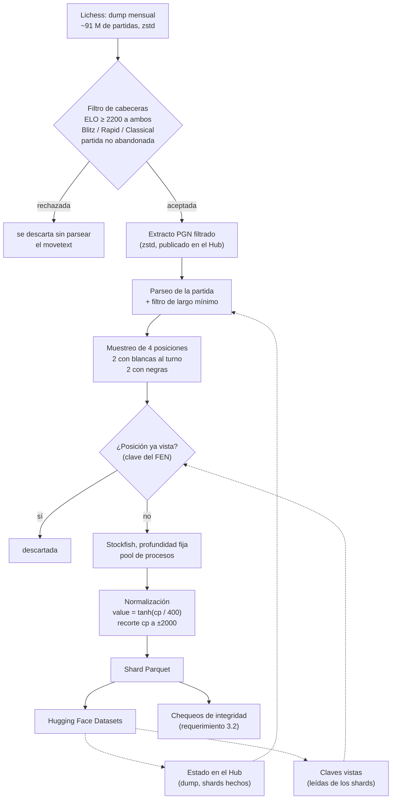

# Pipeline de datos — diagrama de flujo y decisiones

Documento técnico del bloque 3 del WBS. Cubre el diagrama de flujo del pipeline
(uno de los entregables del plan) y las decisiones de diseño que hay que
justificar en la memoria.

## Diagrama de flujo



## Las dos pasadas, y por qué

El pipeline recorre cada dump **dos veces**, con propósitos distintos:

**Pasada 1 — extracción.** Recorre el dump comprimido por streaming y escribe en
un PGN chico solo las partidas que pasan el filtro de cabeceras.

La razón es concreta: un stream zstd **no se puede rebobinar**. Si el etiquetado
leyera directamente del dump, reanudar después de una desconexión de Colab
significaría volver a descargar y descomprimir decenas de gigabytes. Con el
extracto, la pasada cara ocurre una sola vez y todo lo posterior trabaja sobre un
archivo local y chico.

**Pasada 2 — etiquetado.** Lee el extracto, muestrea, evalúa con Stockfish y
escribe shards, subiendo cada uno apenas se cierra.

## El filtro es de dos etapas, por costo

Un dump mensual tiene del orden de 10⁸ partidas y solo una fracción chica pasa el
filtro —medido sobre `2025-06`: **1,82 %**—. Parsear el movetext de cada partida
para después descartar 98 de cada 100 dominaría el tiempo de ejecución.

Por eso el escáner decide **desde las cabeceras solas**, sin construir un tablero
ni un objeto de partida, y las partidas rechazadas ni siquiera acumulan su
movetext en memoria. Solo las aceptadas pasan a `python-chess`.

## Muestreo balanceado por construcción

El requerimiento 1.3 pide balance entre posiciones con blancas y con negras al
turno. Un muestreo aleatorio simple lo cumpliría *en promedio*; el estratificado
lo cumple **en cada partida**: 2 plies pares y 2 impares, elegidos al azar dentro
de cada estrato.

La diferencia importa porque convierte una propiedad estadística —que hay que
verificar y que puede fallar en un subconjunto— en una propiedad estructural.

Las aperturas **no se saltean**: los plies candidatos son todos los de la partida.

## Reproducibilidad del muestreo

La semilla de cada partida se deriva de `(semilla global, game_id)` con un digest
estable, no con `hash()` de Python —que está salteado por proceso—. Así, la misma
partida produce siempre las mismas posiciones, sin importar qué worker la procesó
ni en qué orden, y el resultado se puede reproducir semanas después.

## Normalización e inversa

```
value = tanh(cp / 400)              cp = 400 · atanh(value)
```

- `cp` se recorta a **±2000** antes de transformar. Eso mantiene `|value| < 1`, y
  por lo tanto la inversa nunca diverge —tampoco si la red satura y devuelve
  exactamente ±1—.
- Un **mate en N** colapsa al límite del recorte; las columnas `is_mate` y
  `mate_in` conservan la información que el recorte descarta.
- 400 es la escala clásica de conversión entre centipeones y probabilidad de
  victoria.

## Por qué el dataset guarda FENs y no tensores

El etiquetado con Stockfish es la parte cara e irrepetible del pipeline; la
codificación a tensores es barata y va a seguir cambiando mientras se diseña la
red (bloque 4 del WBS).

Guardar FEN + etiqueta permite **revisar la representación sin re-etiquetar una
sola posición**. El requerimiento 1.2 pide un formato reutilizable, y Parquet con
FENs lo cumple.

## Deduplicación

La clave de deduplicación es un digest de los **cuatro primeros campos del FEN**
(ubicación de piezas, turno, enroques, casilla al paso). Los contadores de
jugadas quedan afuera a propósito: la misma posición alcanzada con distinto reloj
es la misma posición.

El conjunto de claves vistas **no se guarda en ningún archivo**: se reconstruye
al inicio de cada corrida leyendo la columna `pos_key` de los shards ya
publicados. Así la deduplicación vale entre shards y entre sesiones sin que haya
un segundo artefacto que subir después de cada shard ni que pueda quedar
desincronizado con el dataset.

## Reanudación

Se guarda progreso después de **cada shard**. El estado registra, por dump, si ya
está extraído y cuántos shards se completaron; al reanudar se saltean las
partidas ya consumidas del extracto —barato, porque es un archivo local y chico—.

Nada durable vive en disco local. El extracto y el estado se publican en el
repositorio de trabajo del Hub, y los shards en el del dataset; `/content` es
solo un cache que se puede perder sin consecuencias. Por eso la corrida se puede
continuar en una máquina que nunca la ejecutó, sin montar ninguna unidad
(mitigación del Riesgo 6 del plan).

## Manejo de fallas

- **Partida con movetext corrupto:** `python-chess` no falla, ignora los tokens
  que no entiende y devuelve la partida **truncada**. Es inocuo —las posiciones
  alcanzadas siguen siendo legales— y el filtro de largo mínimo descarta lo que
  quedó demasiado corto.
- **Motor caído:** el worker reintenta una vez con un motor nuevo. Una corrida de
  varias horas no se pierde por un subproceso que murió; la posición que falla
  dos veces se descarta y el resumen informa cuántas se perdieron.
- **Guardado del estado:** se escribe a un archivo temporal y se renombra, así una
  interrupción no puede dejar un estado truncado —perder el registro de progreso
  significaría re-etiquetar todo—.

## Trazabilidad

Cada fila del dataset lleva su propia procedencia: `sf_version` (leída del
handshake UCI del motor, no escrita a mano), `sf_depth`, `src_dump`, `game_id` y
`ply`. El dataset se documenta a sí mismo, que es lo que pide el requerimiento 2.3.

## Qué pasó al correrlo de verdad

El pipeline se ejecutó completo en Colab Pro sobre el dump `2025-06`. Los números
de esta sección son los que quedaron guardados en las notebooks; sirven para
dimensionar una corrida futura sin tener que estimar.

**Entorno.** Colab asignó **2 vCPU**, no más. El paralelismo sale de
`os.cpu_count()`, así que el pipeline usó 2 workers. Es el factor que domina el
tiempo total: el etiquetado es puro CPU y escala casi lineal con los workers.

**Pasada 1 — extracción.** Recorrió **91.189.178 partidas** y aceptó
**1.661.093** (tasa del **1,82 %**), en algo más de una hora. El extracto
filtrado resultante pesa unos 825 MB comprimidos y se publicó en el repositorio
de trabajo del Hub, así que esta pasada no hay que repetirla nunca más para este
dump.

El survey previo (notebook `00`) había estimado la tasa en 1,76 % sobre el primer
millón de partidas. La diferencia con el 1,82 % real es chica, que es todo lo que
se le pide: el survey existe para decidir cuántos meses hacen falta, y acertó en
que **alcanzaba con uno solo**.

**Pasada 2 — etiquetado.** A profundidad 12 con 2 workers el ritmo fue de
**~12 posiciones por segundo**. Llegar a 2.552.804 posiciones tomó 157 shards.
Se consumió el **47 % del extracto**: el mes sobra, y ampliar el dataset no
requiere bajar otro dump, solo seguir corriendo la misma celda.

**Rendimiento por shard.** El techo teórico es 4 posiciones × 5.000 partidas =
20.000 por shard. El real arrancó en 18.224 (91 %) y bajó a 17.282 (86 %) para el
quinto shard. La pérdida es casi toda deduplicación, y **crece con el tamaño del
dataset** —1.560 duplicados en el primer shard, 2.558 en el quinto— porque cada
posición nueva se compara contra un conjunto cada vez mayor. Las partidas
descartadas por quedar cortas tras el parseo son un efecto menor: entre 40 y 60
por shard, del orden del 0,3 %.

Esto tiene una consecuencia práctica para planificar: el rendimiento por shard
**decae** a medida que el dataset crece. Estimar el tiempo total multiplicando
por el rendimiento del primer shard subestima.

**Resultado.** 2.552.804 posiciones, 772.797 partidas distintas, 3,30 posiciones
por partida efectivas (de las 4 muestreadas), los ocho chequeos de integridad en
verde y cero duplicados.
